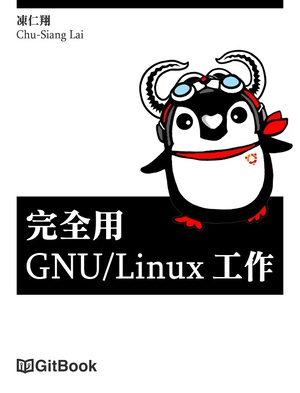

# 出版書籍 (Book)

## 現代 IT 人一定要知道的 Ansible 自動化組態技巧

**Chu-Siang Lai 著**

* 出版商：GitBook
* 出版日期：2016-12-31
* 定價：Free
* 語言：繁體中文
* GitBook: https://www.gitbook.com/book/chusiang/automate-with-ansible/details
* GitHub: https://github.com/chusiang/automate-with-ansible
* License: CC BY-NC-SA 3.0

Ansible 是個與 Puppet, SaltStack, Chef 並駕齊驅的組態設定 (Infrastructure as Code) 工具，其簡單易用的特性讓人愛不釋手，在 DevOps 界更佔有一席之地。

本次凍仁將帶領大家一探 Ansible 這門技藝，並分享些實戰經驗。相信有了 Ansible 我們都可以提早下班了！ (笑)

若需勘誤，觀迎大家來信 *automate-with-ansible (at) drx.tw*，(當然您也可以上 GitHub 網站送 Pull Request 或發 issues)。

## 完全用 GNU/Linux 工作

**Chu-Siang Lai 著**

* 出版商：GitBook
* 出版日期：2015-05-09
* 定價：Free
* 語言：繁體中文
* GitBook: https://www.gitbook.com/book/chusiang/working-on-gnu-linux/details
* GitHub: https://github.com/chusiang/working-on-gnu-linux
* License: CC BY-NC-SA 3.0

GNU/Linux 至今已經相當成熟並足以應付日常生活之使用，凍仁也於 2009 年開始使用它來工作至今，將藉由此書來撰寫較有系統的文章及分享些上班經驗。

若需勘誤，觀迎大家來信 *working-on-gnu-linux (at) drx.tw*，(當然您也可以上 GitHub 網站送 Pull Request 或發 issues)。